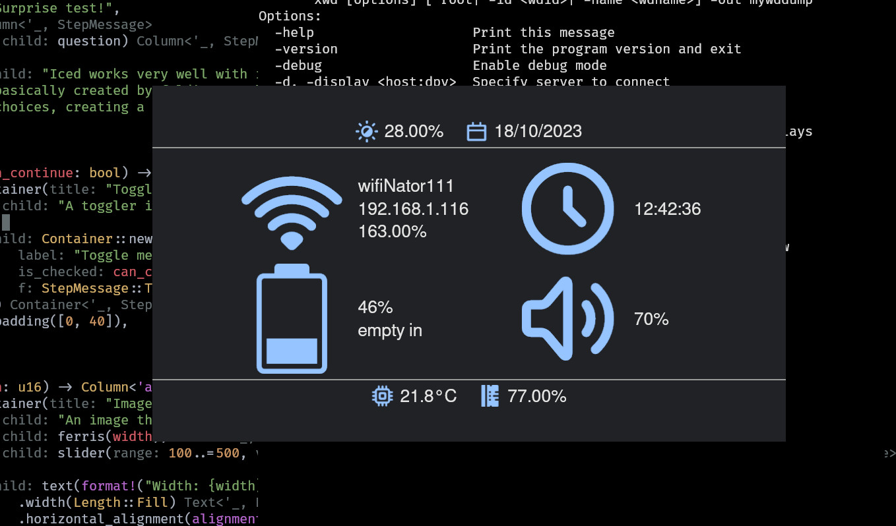

# infonator
A program that simply displays a set of useful information.

I am making this program because I wanted to make a desktop environment without a status bar.
> I'd rather have a large window showing all the information I need when I hold down a key, than a small bar covering the screen all the time

**philosophy**
1. fast startup time
2. fixable: gathering information is separeted into simple scripts, that can be fixed by the user
3. good defaults: despite giving responsibilty to the user, it is still important to work well out of the box

## configure
To configure you will use the command line program `infonator-set`. Here you can customize `infonator`, or specify the path to *info scripts* it will use to aquire information to displayed. Run `infonator-set help` to see what's available.

## info scripts
To aquire useful information, the program will run user info scripts set by `infonator-set`. Inside `example-config` you can find examples. These are platform dependent, and may not work. Tips:
- install dependencies the scripts may require
- check that you have installed the right command line interpreter, available: `bash`

## run
To diplay infonator window, simply run `infonator`. This ofcourse assumes you have it installed.

## install
> the program is not released anywhere yet

## build from source
To build from source, make sure you have *git* and the *rust toolchain* installed.

#### build
- `git clone <repo address>`
- `cd infonator`
- `cargo build --release`

#### run
You can find the two binaries in the folder `target`->`release`.
